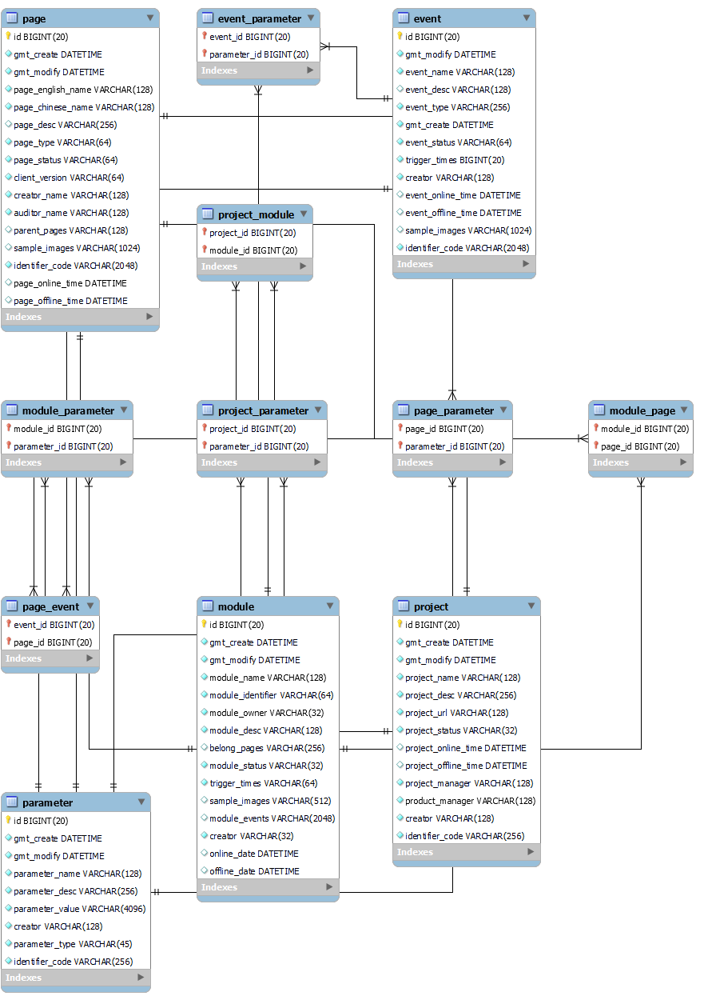
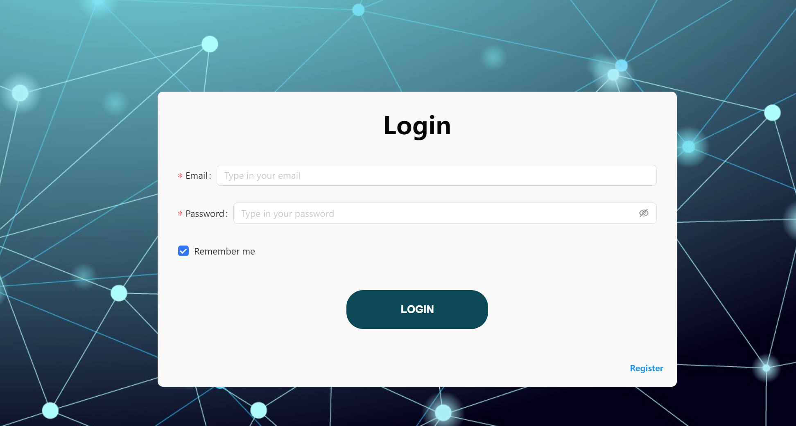
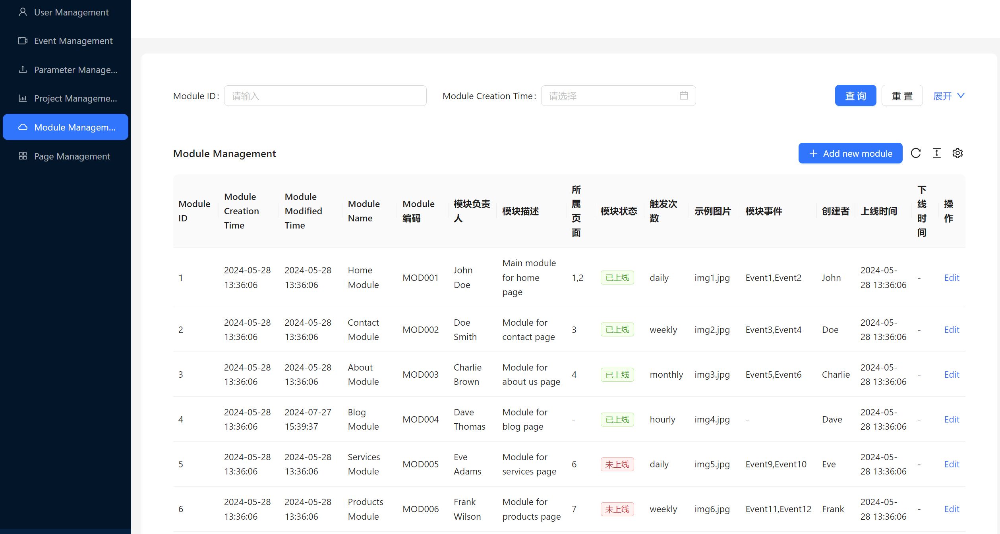
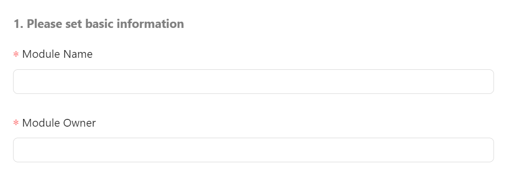
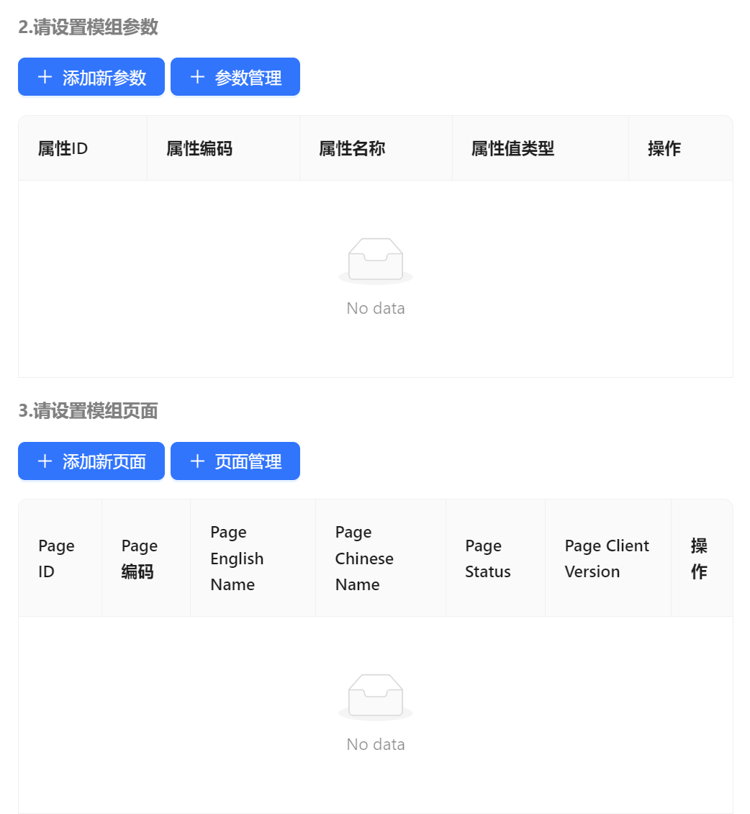
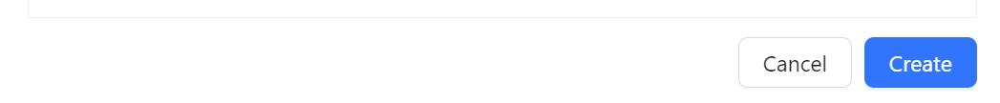
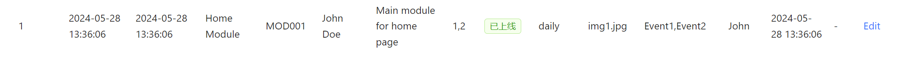

# 埋点管理系统设计

# 后端设计

后端使用Spring Boot 3 + Spring Security 6 + JPA + Mongoose + Lettuce实现

## MVC 设计

### Controller层

每个对象提供下列五个路由:

- `base/meta`: 用于获取一个对象的元信息，包括`对象ID, 对象编码`
- `base/all`: 用于获取所有对象，结果包含外键对象数组
- `base/allfiltered`: 用于获取所有对象(经过字段筛选)，结果包含外键对象数组
- `base/{id}`: 根据`对象ID`获取对象
- `base/create`: 创建一个新的对象
- `base/update`: 更新已有对象，通过`对象ID`找到数据库中已有对象


### Service层

**Service为每个对象提供五个方法, 和Controller层对应**

```
List<EventEntityGetObjectDTO> getAllEntities();

List<EventEntityGetObjectDTO> getAllEntitiesFiltered(EntitySearchCriteria searchCriteria);

List<GetIdentifiersDTO> getAllMetaData();

EntityGetObjectDTO getEntityById(Long entityId);

Message createEntity(EntityUpdateObjectDTO entityUpdateObjectDTO);

Message updateEntity(EntityUpdateObjectDTO entityUpdateObjectDTO);
```

**Service层为每个对象增改方法提供辅助方法:**

- 将一个用户提交对象转化为具有正确创建/修改时间的数据库持久化对象。


### Persistence层

#### MySQL 数据库



- Project和Module之间存在多对多关系
- Module和Page之间存在多对多关系
- Page和Event之间存在多对多关系
- Project, Module, Page, Event和Parameter之间均存在多对多关系


MySQL数据库用于保存所有的管理对象信息，包括参数，事件， 页面，模组，项目对象。

`Spring JPA`为每个对象提供两类抽象:

- `EntityRepository`: 用于处理增删改查， 参数，事件， 页面，模组，项目对象拥有自己的`EntityRepository`。
- `Entity1Entity2MappingRepository`用于处理多对多关系， 参数 <-> 事件，事件 <-> 页面，页面 <-> 模组，模组 <-> 项目的连表关系拥有自己的`Entity1Entity2MappingRepository`


#### MongoDB数据库

MongoDB 用于持久化储存用户提交的个人信息头像图片， imageId保存在`MySQL`中用于在`login`时查询。


#### Redis数据库

ResdisDB 用于储存用户注册时提交的个人信息头像图片，缓存在内存中, 用于图片预览。


## Security 设计

登录认证采用`stateless token-based authentication`, 使用`Jwt Token`实现。

- 用户登录时产生`token`, 返回给用户保存在前端
- 用户后续访问`protectedroutes`时在请求头中带上`Authorization: Bearer token`
  - 认证成功`status code: 200`
  - 认证失败`status code: 401`


# 前端设计

前端使用React + Redux + Router +  Axios + Antd + Vite + Typescript +  Javascript实现

## 用户登录认证

使用React-Redux实现

- 用户登录经过后端认证以后将返回的`token`保存在`localStorage`中
- 用户发送的任何需要权限认证的请求都会经过`axios`拦截器，添加请求头`Authroization: Bearer token`
- 用户信息会被保存在全局的`store`对象中


## 路由结构

```jsx
<Router>
  <Routes>
      <Route path="/" element={<Navigate replace to="/login" />} />
      <Route path="/login" element={<LoginPage />} />
      <Route path="/home" element={<ProtectedRoute element={<HomePage />} />} />
  </Routes>
</Router>  
```

- `ProtectedRoute`是需要认证的页面


## 内容展示

定义公共组件`EditableTable`用于管理数据对象和对象关系:

```tsx
<EditableTable
    setMenuIndex = {setMenuIndex}
    entityName = {entityName}
    entityTableColumns = {entityTableColumns}
    entityCreateFields = {entityCreateFields}
    entityEditFields = {entityEditFields}
    addprosConfig = {addprosConfig}
></EditableTable>
```

- 功能包括
  - 修改对象本身，以及对象之间的关系
  - 增加对象，以及对象之间的关系
  - 查询对象


# 使用方法

## 登录注册




## 数据展示



- 点击左侧菜单栏切换需要管理的对象
- 上方字段用于过滤对象条目


## 新增数据




- 点击`Add New Entity`弹出对话框，用户输入新增对象信息注入数据库
- 点击`添加新参数`选择将要添加到当前对象的额外属性
- 点击`Create`提交修改


## 修改数据



- 点击右侧`Edit`进行数据修改
- 点击`Submit`提交修改